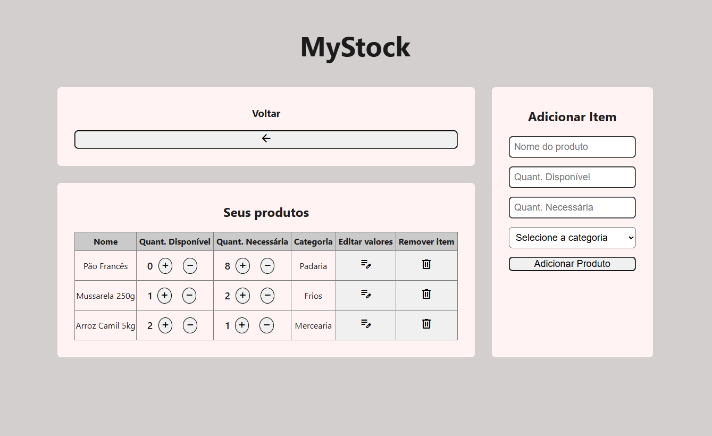

# 🗂️ MyStock v0.3

Gerenciador de mantimentos domésticos, para controle em compras no supermercado, atacado e semelhantes. 
<strong>Fun Fact: </strong>Este é o meu primeiro projeto usando React.js! <strong>Espero que goste :D, abraços <a href="https://github.com/SamuMeneDev">Samu Mene</a></strong>
<h3><strong>Link do Projeto: </strong><a href="https://my-stock-eight.vercel.app">MyStock Web</a>.</h3>

## 🔧 Atualizações e melhorias
- Responsividade para dispositivos móveis.
- Barra de escrolagem na tabela de produtos.
- Melhorias na estilização de interface.
- Limpeza de código.

## ⚙️ Tecnologias Usadas

  

## 📄 Sobre do projeto

### 💡 Ideia do projeto
Sempre que vamos ao mercado, corremos o risco de esquecer algum item na nossa lista de compras, ou sequer usar uma, o que resulta em estresse e compras mais caras. 
Com a finalidade de resolver esse problema, desenvolvi esse <strong>Sistema de Controle de Estoque Doméstico</strong>, onde o usuário preenche os seus itens de compras, sua quantidade mínima para um período e a quantidade atual. 

A aplicação logo em sua tela principal - assim que o usuário cadastrar os produtos - mostrará caso algum item estivel em falta na lista, desta forma auxiliando em compras claras e objetivas.
<figure align="center" >
    <figcaption align="center">
        <h2>Página Inicial da aplicação</h2>
        Imagem 01
    </figcaption>
    

### 🛠 Guia do projeto
Segue um guia de como usar a aplicação: <a href="./my-app/README.md">Guia do app</a>

#### 🛍 Categorias de produto
Em primeiro momento, foram registradas <strong>14</strong> categorias de produtos:

- Bebidas
- Mercearia
- Limpeza
- Higiene
- Padaria
- Biscoitos/Lanches
- Papelaria
- Pet-Shop
- Frios
- Hortifruti
- Carnes
- Congelados
- Doces
- Embalagens
## ⏳ Em breve
Estou estudando e quero desenvolver uma versão mobile dessa aplicação, sendo mais conveniente em uma ida ao mercado.
