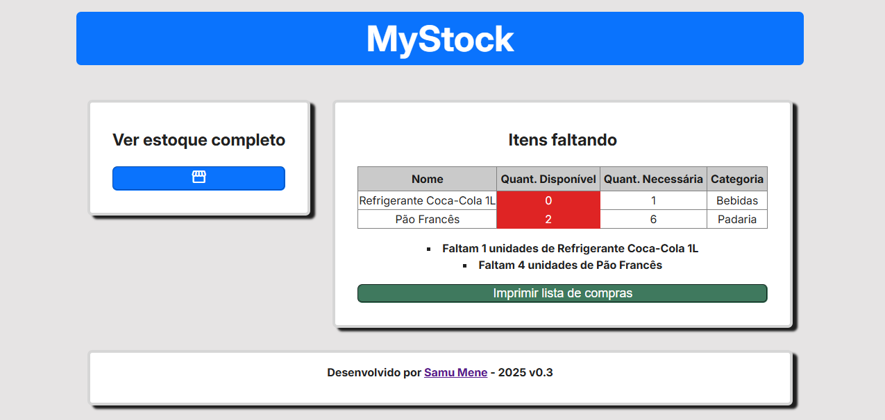
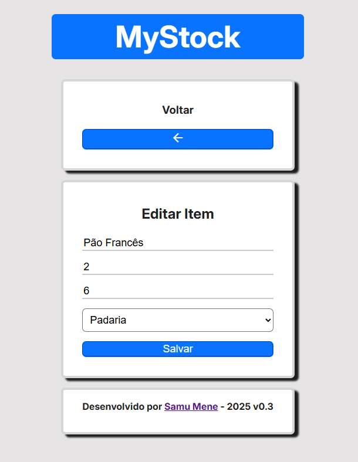

# 🗂️ MyStock v0.2

Gerenciador de mantimentos domésticos, para controle em compras no supermercado, atacado e semelhantes. 

<strong>Fun Fact: </strong>Este é o meu primeiro projeto usando React.js!

## ⚙️ Tecnologias Usadas

  

## 📄 Guia do projeto

### 💡 Ideia do projeto

Sempre que vamos ao mercado, corremos o risco de esquecer algum item na nossa lista de compras, ou sequer usar uma, o que resulta em estresse e compras mais caras. 
Com a finalidade de resolver esse problema, desenvolvi esse <strong>Sistema de Controle de Estoque Doméstico</strong>, onde o usuário preenche os seus itens de compras, sua quantidade mínima para um período e a quantidade atual.  
<figure>
    <figcaption><h2 align="center">Página de produtos da aplicação</h2></figcaption>
    
</figure>
A aplicação logo em sua tela principal - assim que o usuário cadastrar os produtos - mostrará caso algum item estivel em falta na lista, desta forma auxiliando em compras claras e objetivas.
<figure>
    <figcaption><h2 align="center">Página inicial com alertas de itens em falta</h2></figcaption>
    
</figure>

### 🛒 Impressão da lista de compras
Quando se tem itens em falta, é possível gerar um PDF com a lista organizada por categorias em ordem alfabética.

<figure>
    <figcaption><h2 align="center">Botão de impressão e PDF gerado</h2></figcaption>
    
    
</figure>

### 🛍 Categorias de produto

Em primeiro momento, foram registradas <strong>14</strong> categorias de produtos:
- Bebidas
- Mercearia
- Limpeza
- Higiene
- Padaria
- Biscoitos/Lanches
- Papelaria
- Pet-Shop
- Frios
- Hortifruti
- Carnes
- Congelados
- Doces
- Embalagens

### ✍ Edição detalhada de produto
É possivel realizar uma edição mais profunda do produto no campo "Editar valores" da página de produtos.
<figure>
    <figcaption><h2 align="center">Botão "Editar valores"</h2></figcaption>
        
</figure>
<figure align="center">
    <figcaption><h2 align="center">Edição de todos os campos do item</h2></figcaption>
        
</figure>

## ⏳ Em breve
Estou estudando e quero desenvolver uma versão mobile dessa aplicação, sendo mais conveniente em uma ida ao mercado.
