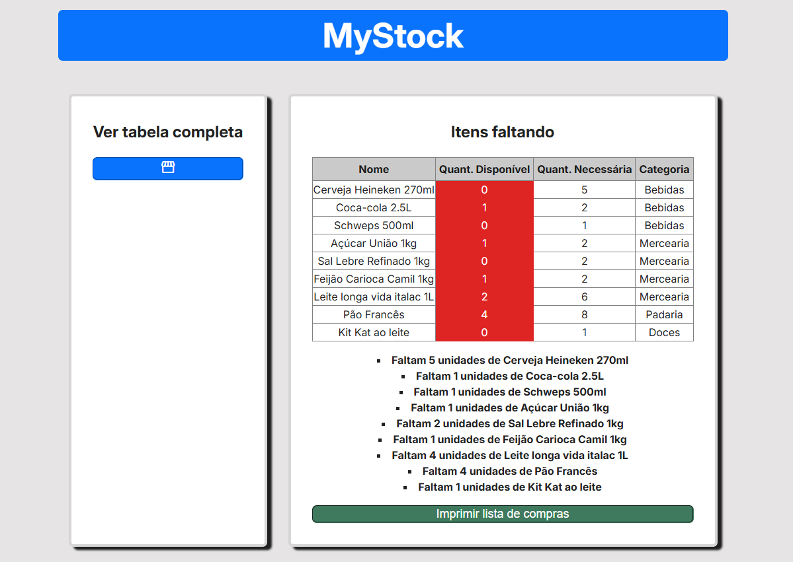

### 🛠 Guia do projeto

Com o objetivo de guiar novos usuários, abaixo segue um guia de como usar a aplicação.
<figure align="center" >
    <figcaption align="center">
        <h2>Página Inicial da aplicação</h2>
        Imagem 01
    </figcaption>
    
</figure>
Na pagina inicial temos a logo do projeto, um seção que mostra os itens que estão em falta no nosso estoque (por enquanto está vazia por que não temos nenhum item adicionado) e outra seção com um botão onde é possível ver todos os itens adicionados pelo usuário.

<figure align="center">
    <figcaption align="center">
        <h2>Página de produtos da aplicação</h2>
        Imagem 02
    </figcaption>
    
</figure>

