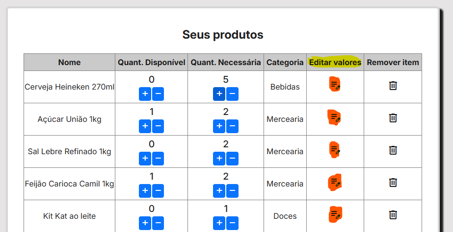
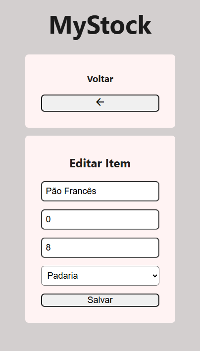
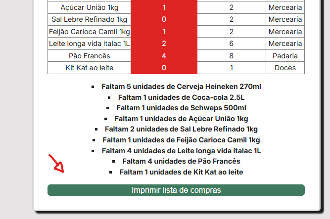
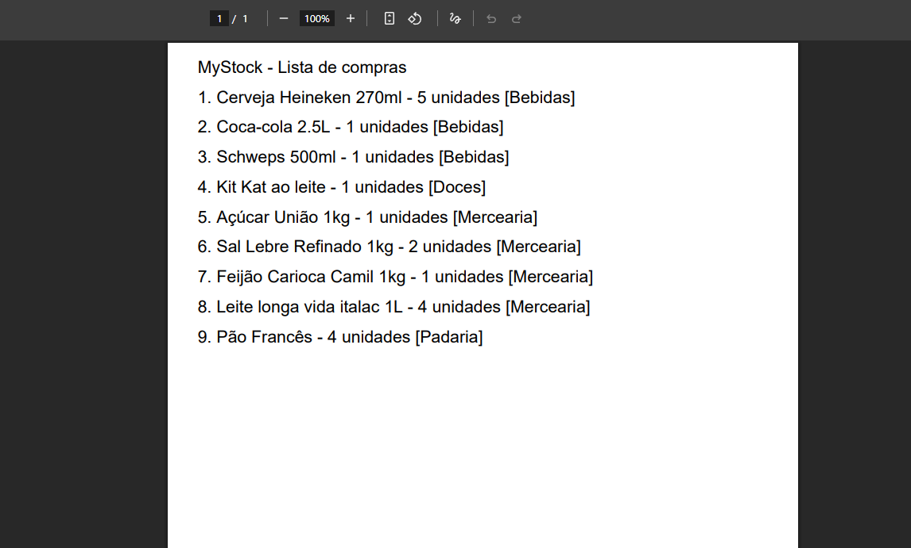

# 🛠 Guia do projeto

Com o objetivo de guiar novos usuários, abaixo segue um guia de como usar a aplicação.
<figure align="center" >
    <figcaption align="center">
        <h2>Página Inicial da aplicação</h2>
        <h3>Imagem 01</h3>
    </figcaption>
    
</figure>
Na pagina inicial temos a logo do projeto, um seção que mostra os itens que estão em falta no nosso estoque (por enquanto está vazia por que não temos nenhum item adicionado) e outra seção com um botão onde é possível ver todos os itens adicionados pelo usuário.

<figure align="center">
    <figcaption align="center">
        <h2>Página de produtos da aplicação</h2>
        <h3>Imagem 02</h3>
    </figcaption>
    
</figure>

Na página de produtos, é possivel:  ver o nosso estoque e adicionar produtos. Para adicionar novos produtos devemos inserir o nome do mesmo (Ex. Pão Francês), a **Quantidade Disponível** - isto é a quantidade que o usuário tem desse produto X, a **Quantidade Necessária** do produto - a quantidade que o usuário necessita desse produto até a proxima ida no mercado, e por fim a categoria do produto no supermercado (Ex. Padaria). Vamos cadastrar alguns produtos no nosso estoque.

<figure align="center">
    <figcaption align="center">
        <h3>Imagem 03</h3>
    </figcaption>
    
</figure>

Após as inserção de dados, uma tabela se formará com os dados que preenchemos. Na tabela, é possível alterar as quantidade informadas além de excluir e editar com mais detalhes na opção "Editar valores"

<figure align="center">
    <figcaption align="center">
        <h2>Edição do produto "Pão Francês"</h2>
        <h3>Imagem 04</h3>
    </figcaption>
    
</figure>

Voltando para a tela inicial, somos informados de quais itens estão em falta e quantas unidades precisam ser compradas para preencher o estoque
<figure align="center">
    <figcaption align="center">
        <h2>Tela inicial com os alertas</h2>
        <h3>Imagem 05</h3>
    </figcaption>
    
</figure>
Também fica disponível um botão que gera um PDF da lista de compras desses itens organizadas por categoria, com o nome, sua respectiva categoria e quantidade à ser comprada
<figure align="center">
    <figcaption align="center">
        <h2>PDF da lista de compras</h2>
        <h3>Imagem 06</h3>
    </figcaption>
    
</figure>

E essas são as funções básicas do sistema! Espero ter sido claro e muito obrigado 
<strong>Guia escrito por: <a href="https://github.com/SamuMeneDev">Samu Mene</a> - 2025</strong>